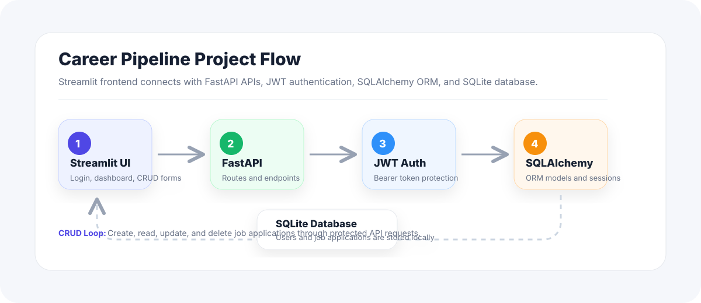
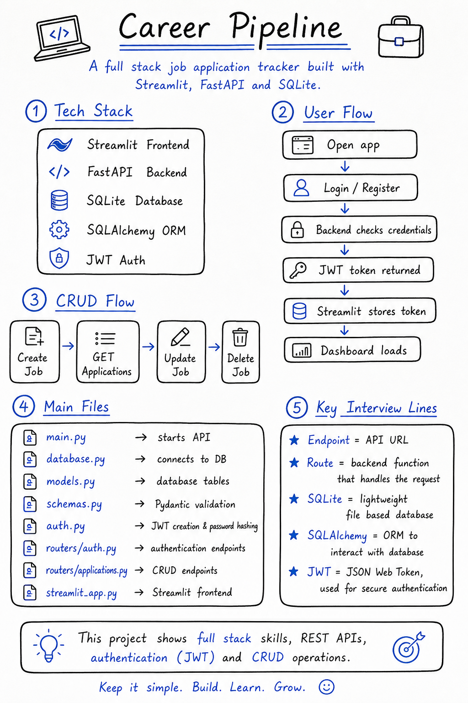

# Career Pipeline

Career Pipeline is a job application tracking project built with FastAPI, SQLite, SQLAlchemy, JWT authentication, and Streamlit.

The app allows users to register, log in, and manage job applications through a clean dashboard with full CRUD functionality.

## Project Visuals



## Handwritten Overview



## Tech Stack

- Backend: FastAPI
- Frontend: Streamlit
- Database: SQLite
- ORM: SQLAlchemy
- Authentication: JWT
- Validation: Pydantic

## Features

- User registration
- User login with JWT authentication
- Protected current-user route
- Create job applications
- View job applications
- Update job applications
- Delete job applications
- Pipeline-style dashboard
- Search and status filtering
- Streamlit frontend connected to FastAPI APIs

## Project Flow

```text
User opens Streamlit app
-> User registers or logs in
-> FastAPI validates credentials
-> Backend returns JWT token
-> Streamlit stores token in session_state
-> Frontend calls protected APIs with the token
-> Dashboard loads and manages job applications
```

## API Endpoints

```text
GET    /
POST   /auth/register
POST   /auth/token
GET    /auth/me
GET    /applications
POST   /applications
GET    /applications/{application_id}
PUT    /applications/{application_id}
DELETE /applications/{application_id}
```

## Folder Structure

```text
app/
  main.py
  database.py
  models.py
  schemas.py
  auth.py
  routers/
    auth.py
    applications.py
assets/
  auth-career-hero.png
  career-pipeline-handwritten-overview.png
  project-pipeline-diagram.svg
streamlit_app.py
requirement.txt
README.md
```

## Setup

Create and activate a virtual environment:

```bash
python -m venv .venv
.venv\Scripts\activate
```

Install dependencies:

```bash
pip install -r requirement.txt
```

## Run Backend

```bash
uvicorn app.main:app --reload
```

Backend runs at:

```text
http://127.0.0.1:8000
```

Swagger docs:

```text
http://127.0.0.1:8000/docs
```

## Run Frontend

Open a second terminal and run:

```bash
streamlit run streamlit_app.py
```

Frontend runs at:

```text
http://127.0.0.1:8501
```

## Demo Login

```text
username: usman
password: 12345678
```

## Core Concepts Covered

- FastAPI routing and endpoints
- Pydantic schemas for validation
- SQLAlchemy models and sessions
- SQLite database integration
- JWT token creation and verification
- Password hashing
- Protected API routes
- Streamlit session state
- Frontend-to-backend API integration
- CRUD operations

## Status

The project currently includes working authentication, protected APIs, job application CRUD, and a Streamlit dashboard UI.
